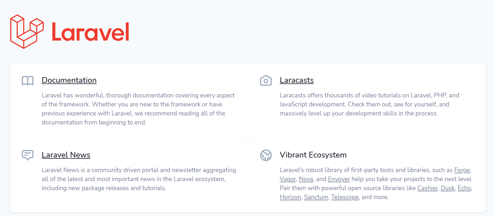

# Primeros pasos con Laravel

<div style="text-align: right">
<a target="_blank" href="slides/01c.html"></a>&nbsp;&nbsp;
<a target="_blank" href="01c.pdf"></a>
</div>

Ahora que ya tenemos todo el sistema preparado para desarrollar proyectos Laravel, veamos los primeros pasos que debemos dar para crear estos proyectos.

Para tener localizados todos los proyectos, podemos crear una carpeta que los contenga. Por ejemplo, podemos definir una carpeta llamada `ProyectosLaravel` en nuestra carpeta personal (en la carpeta `/home/alumno`, si usamos la máquina virtual proporcionada). Los proyectos que hagamos a partir de ahora los ubicaremos dentro de esta carpeta, cada uno en su propia subcarpeta.

## 1. Crear proyectos Laravel

Para crear proyectos Laravel, emplearemos el comando `laravel` que ya deberíamos tener disponible, si hemos seguido los pasos dados en el documento de [software necesario](01b), o si estamos utilizando la máquina virtual proporcionada, donde ya viene el comando instalado. Nos deberemos ubicar en la carpeta donde queramos crear el proyecto (la carpeta "*ProyectosLaravel*" que hemos comentado anteriormente), y escribir este comando:

```
laravel new nombre_proyecto
```

Por ejemplo, para las pruebas que iremos construyendo poco a poco en las siguientes sesiones, vamos a crear una web de libros, por lo que, en nuestra carpeta `ProyectosLaravel`, comenzaremos escribiendo este comando:

```
laravel new biblioteca
```

Esto creará un proyecto `biblioteca` en una subcarpeta con el mismo nombre. Alternativamente, también se puede emplear la herramienta `composer` para crear el proyecto, usando la siguiente sintaxis (también desde la carpeta donde queramos ubicar el proyecto):

```
composer create-project --prefer-dist laravel/laravel biblioteca
```

En cualquiera de los dos casos, se creará una carpeta "biblioteca" con el contenido inicial del proyecto dentro, empleando la última versión de Laravel disponible.

### 1.1. Crear proyectos Laravel usando versiones anteriores

Al crear un proyecto con el comando `laravel new`, se creará con la última versión disponible de Laravel. En el caso de que necesitemos crear un proyecto Laravel que no utilice la última versión, sino alguna anterior, necesitamos utilizar la herramienta `composer` para especificar el número de versión de Laravel que queremos utilizar. Por ejemplo, este comando crea un proyecto llamado "prueba" utilizando Laravel 7:

```
composer create-project --prefer-dist laravel/laravel prueba 7.x
```

### 1.2. El comando *artisan*

Cuando se crea un proyecto Laravel, se instala una herramienta llamada `artisan` en la raíz del proyecto. Es una interfaz de línea de comandos (CLI, *Command Line Interface*), que proporciona una serie de opciones adicionales que nos vendrán bien en nuestra gestión de proyectos Laravel para, por ejemplo, crear controladores, migrar datos a una base de datos, etc.

Para comprobar que está instalada y las opciones que ofrece, podemos escribir el siguiente comando en un terminal desde la carpeta del proyecto que hayamos creado (recuerda que puedes utilizar el terminal integrado de Visual Studio Code, con el proyecto abierto, para ejecutar el comando directamente desde la raíz del proyecto):

```
php artisan list
```

Y obtendremos un listado de las opciones que ofrece *artisan*. Algunas, como decimos, las utilizaremos más adelante. Para empezar, podemos ejecutar este comando para comprobar la versión de Laravel del proyecto en el que estamos:

```
php artisan --version
```

## 2. Estructura de un proyecto Laravel

Cuando creamos un proyecto Laravel, se crea una estructura de carpetas y archivos predefinida. Explicamos ahora brevemente en qué consisten las principales carpetas y archivos que se generan:

* `app`: contiene el código fuente de la aplicación. Gran parte de las clases que definamos estarán en esta carpeta. Inicialmente, se incluyen algunas subcarpetas dentro:
  * `Console`: para definir nuestros propios comandos
  * `Exceptions`: para definir nuestras propias excepciones
  * `Http`: contiene los controladores y el *middleware*
  * `Providers`: contiene los proveedores de servicios de la aplicación, más los que podamos definir nosotros.
  * Además, aquí se incluyen, o se pueden incluir, carpetas adicionales para nuestra aplicación, como la carpeta `Events` para definir los eventos que ocurran, o distintas carpetas para almacenar el modelo de datos o clases de nuestra aplicación.
* `bootstrap`: contiene el archivo `app.php`, que es el que pone en marcha la aplicación. Además, contiene la carpeta `cache`, donde se almacenan los archivos ya cargados por Laravel para acelerar su acceso en futuras peticiones.
* `config`: contiene los archivos de configuración de la aplicación, donde se tienen variables de entorno, o si nuestra aplicación está en desarrollo o producción, o los parámetros de conexión a la base de datos, entre otras cosas. 
* `database`: almacena los elementos de gestión de la base de datos, tales como generadores de objetos, migraciones, etc.
* `public`: contenido visible de la web. Contiene el archivo `index.php`, punto de entrada de todas las peticiones a la web, además de carpetas donde ubicar el contenido estático del cliente (imágenes, hojas de estilo CSS, archivos JavaScript...).
* `resources`: contiene, por un lado, las vistas de nuestra aplicación. Por otro lado, también contiene archivos no compilados de CSS (archivos *sass*) y JavaScript (archivos sin minimizar u optimizar). Además, también almacena los archivos de traducción, en el caso de que queramos hacer sitios multi idioma.
* `routes`: almacena las rutas de la aplicación, tanto para acceder a contenido web normal (`web.php`), como para servicios web (`api.php`), como para comandos y otras opciones.
* `storage`: contiene las vistas compiladas, y otros archivos generados por Laravel, como los logs o las sesiones.
* `test`: para almacenar los tests o pruebas sobre los componentes de nuestra aplicación
* `vendor`: donde se almacenan las dependencias o librerías adicionales que se requieren en nuestro proyecto Laravel. Nuevamente, esta carpeta debería ser ignorada por Git, y regenerada cada vez que se clone el repositorio remoto, para evitar almacenar demasiada información innecesaria.

Aunque algunos de los conceptos vistos aquí pueden no estar claros aún (como el concepto de *middleware*, o los proveedores de servicios), los iremos viendo poco a poco durante el curso.

### 2.1. Configuración general del proyecto

De entre la estructura de carpetas de un proyecto Laravel vista anteriormente, echaremos ahora un rápido vistazo a dónde se encuentra la configuración general del proyecto.

Por un lado, disponemos de un archivo `.env` en la raíz del proyecto, que básicamente contiene una serie de variables de entorno generales. Por ejemplo, se tiene la variable `APP_NAME` con el nombre que queremos que tenga la aplicación, o un conjunto de variables que utilizaremos más adelante para conectar con la base de datos, entre otras cosas:

```
APP_NAME=Laravel
...
DB_CONNECTION=mysql
DB_HOST=127.0.0.1
DB_PORT=3306
DB_DATABASE=laravel
DB_USERNAME=root
DB_PASSWORD=
...
```

En general, los cambios de configuración es preferible hacerlos en este archivo `.env`, de forma que en los archivos de la carpeta `config` accederemos a estas variables de entorno definidas en `env`. Por ejemplo, podemos definir las propiedades del archivo `.env` de este modo para el proyecto *biblioteca* que hemos creado anteriormente:

```
APP_NAME=Biblioteca
...
DB_CONNECTION=mysql
DB_HOST=127.0.0.1
DB_PORT=3306
DB_DATABASE=biblioteca
DB_USERNAME=root
DB_PASSWORD=
...
```

> **NOTA:** Además, el archivo `.env` está configurado (o debe configurarse, de lo contrario) para ser ignorado por Git, de modo que no se suba a repositorios, y se evite un acceso a datos confidenciales que pongan en riesgo el acceso al sistema.

Por otra parte, la carpeta `config` contiene unos archivos generales de configuración. Iremos viendo algunos de ellos en sesiones posteriores, pero, para empezar, podemos echar un vistazo al archivo `config/app.php`, que contiene parámetros de configuración general de la aplicación. Por ejemplo, podemos modificar el nombre de la aplicación, en la propiedad `name`, aunque, como vemos, el nombre lo coge de la propiedad `APP_NAME` del archivo `.env`. 

```php
'name' => env('APP_NAME', 'Laravel'),
```

Es más habitual modificar los valores del archivo `.env` que los que hay en este archivo de configuración. Pero, en algunos casos, sí convendrá acudir a alguno de los archivos de esta carpeta y modificar la información que contiene.

## 3. Arquitectura de un proyecto Laravel

Una vez vista la estructura de carpetas y archivos que se genera cuando creamos un proyecto Laravel, es importante también tener unas nociones básicas de cómo se interconectan los elementos internamente, y qué hace que un proyecto Laravel se pueda poner en marcha.

### 3.1. Los proveedores de servicios (*service providers*)

Los proveedores de servicios son los principales responsables del arranque o puesta en marcha de todo proyecto Laravel, lo que se conoce como *bootstrapping*. Se encargan de registrar los componentes del proyecto, dependencias externas, clases y métodos definidos por nosotros, para hacerlos accesibles al resto de la aplicación.

Si abrimos el archivo `config/app.php` de nuestro proyecto Laravel, veremos entre otras cosas una sección denominada `providers`, donde se define un array con todos los proveedores de servicios que se ponen en marcha al arrancar la aplicación. Por ejemplo, hay proveedores de servicios para acceso a la base de datos (*DatabaseServiceProvider*), autenticación de usuarios (*AuthServiceProvider*), etc. 

### 3.2. Las clases del núcleo de Laravel

Para poder desarrollar los componentes de las aplicaciones Laravel, es necesario contar con una infraestructura previa de clases que nos faciliten esta tarea. Así, a lo largo de las siguientes sesiones haremos uso de algunas clases proporcionadas por Laravel que vienen preinstaladas con el framework, tales como `Model`, `Route`, etc, y que nos permiten o bien heredar de ellas para crear otras subclases (como es el caso de los modelos de datos) o bien utilizar algunos métodos de utilidad que estas clases proporcionan (como es el caso de la clase `Route`, por ejemplo).

Conviene tener presente que todas estas clases pertenecientes al núcleo de Laravel parten de un espacio de nombres común llamado `Illuminate`, por lo que, en los archivos fuente donde las utilicemos, será frecuente encontrar instrucciones `use` que comiencen por dicho espacio de nombres. Por ejemplo:

```php
use Illuminate\Database\Eloquent\Model;
```

### 3.3. Otros elementos

Además de los dos pilares anteriores sobre los que se sustenta fundamentalmente el desarrollo de proyectos en Laravel, podemos hablar de otros elementos que nos pueden resultar de utilidad en el desarrollo, como son los *facades* y los *contracts*.

Las *facades* proporcionan una interfaz estática a los elementos de la aplicación, de forma que facilitan el acceso a ciertos métodos o utilidades. Por ejemplo, la *facade* `Cache` permite acceder de forma sencilla con su método `get` a ciertas propiedades cacheadas previamente.

```php
return Cache::get('key');
```

Los *contracts* son un conjunto de interfaces que proporcionan el núcleo de servicios ofrecidos por Laravel. Por ejemplo, métodos para enviar e-mails, o encolar tareas en una cola de prioridad, etc.

## 4. Prueba de proyectos Laravel

Para poder probar un proyecto Laravel, hay que realizar una serie de pasos previos, tales como asociarlo a un *virtual host* (de Apache, en nuestro caso), y habilitar ciertos permisos en ciertas carpetas. A continuación indicamos los pasos a seguir, y conviene tener presente que:

* El paso 1 deberemos hacerlo **sólo una vez**, cuando demos de alta nuestro primer *virtual host* con Apache.
* El resto de pasos deberemos hacerlos **una vez por proyecto** para configurar dicho proyecto en Apache y establecer los permisos de lectura y escritura adecuados.

**1. Habilitar los *virtual hosts* en Apache**

Los *virtual hosts* son un mecanismo que ofrecen los servidores web, como Apache, para poder asociar carpetas arbitrarias del sistema, externas a la estructura de Apache, al propio servidor, de forma que, accediendo a una URL o nombre de dominio determinado, le indicamos a Apache que cargue los contenidos de esa carpeta.

En primer lugar debemos habilitar los *virtual hosts* en Apache, editando el archivo `/opt/lampp/etc/httpd.conf` y descomentando la línea que hace referencia al lugar donde se definen dichos *virtual hosts*. Debe quedar así:

```
# Virtual hosts
Include etc/extra/httpd-vhosts.conf
```

**2. Añadir el nuevo nombre de dominio**

Después, debemos editar el archivo `/etc/hosts` y asignar un nombre de dominio (local) a nuestro proyecto. Por ejemplo, para el proyecto *biblioteca* que hemos creado antes, podríamos definir algo como esto (al final, o entre los otros registros de nombres existentes en dicho archivo):

```
127.0.0.5   biblioteca
```

Lo que hemos hecho ha sido asignar la IP local 127.0.0.5 (puede ser la IP local que nosotros queramos) al nombre "biblioteca". De este modo, cuando carguemos localmente el proyecto podremos acceder a él mediante la URL *http://biblioteca* o bien con *http://127.0.0.5*.

**3. Definir la configuración del nuevo *virtual host***

A continuación, debemos editar el archivo al que hacía referencia la línea que hemos descomentado antes, `/opt/lampp/etc/extra/httpd-vhosts.conf` y añadir una nueva configuración para nuestro nuevo *virtual host*. Por ejemplo:

```
<VirtualHost 127.0.0.5:80>
  DocumentRoot "/home/alumno/ProyectosLaravel/biblioteca/public"
  DirectoryIndex index.php

  <Directory "/home/alumno/ProyectosLaravel/biblioteca/public">
	Options All
	AllowOverride All
	Require all granted
  </Directory>
</VirtualHost>
```

**4. Establecer los permisos en las carpetas del proyecto**

Para poder probar nuestro proyecto Laravel, además de configurar el servidor web (por ejemplo, Apache) para que apunte a la carpeta `public` del proyecto, y asignarle si es el caso un *virtual host*, es necesario habilitar permisos de acceso y escritura a ciertas carpetas del proyecto:

* Carpeta `storage` junto con sus subcarpetas y contenidos. En esta carpeta se compilarán las vistas, se generarán los archivos de log, etc, por lo que conviene que esta carpeta tenga permisos de escritura.
* Subcarpeta `bootstrap/cache`, donde se almacenará la caché de los archivos ya cargados.

Para habilitar los permisos en estas carpetas, podemos ejecutar estos comandos desde la raíz del proyecto (la opción `-R` aplica los permisos de forma recursiva):

```
sudo chmod -R 777 bootstrap/cache
sudo chmod -R 777 storage
sudo chmod -R 777 storage/logs
```

> **NOTA** El tercer comando no sería necesario en principio, ya que la subcarpeta `logs` está dentro de la carpeta `storage`, y se aplican los cambios de forma recursiva. Sin embargo, es posible que en algunas situaciones esta subcarpeta se cree a posteriori y no tenga los permisos adecuados. Comprobaremos al cargar la aplicación desde el navegador si existe algún error al inicio. En este caso, el propio error indicará que no puede generar el *log*, y deberemos escribir ese comando.

Tras estos pasos, ya podremos acceder a la página de inicio de nuestro proyecto, escribiendo la URL *http://biblioteca*, en este caso.

<div align="center">
    
</div>

Más adelante aprenderemos a modificar esta página de inicio, obviamente, y a ir añadiendo otras.

### 4.1. Otra forma alternativa de probar los proyectos

A través de la herramienta `artisan`, tenemos una alternativa algo más rápida para probar nuestros proyectos Laravel de forma local. Si optamos por esta opción, podemos omitir los pasos 1, 2 y 3 del caso anterior, ya que no vamos a utilizar Apache como servidor. Sólo necesitamos realizar el paso 4 para dar permisos de escritura a las carpetas necesarias, la primera vez que pongamos en marcha la aplicación.

Después, desde la raíz del proyecto, ejecutamos este comando:

```
php artisan serve
```

Esto pondrá en marcha un pequeño servidor para probar el proyecto, y podremos acceder a él desde la URL *http://localhost:8000*, aunque, de todas formas, al ejecutar el comando nos informará de la URL con la que acceder.

## 5. Importando / Exportando un proyecto Laravel

Vamos a indicar ahora unas instrucciones necesarias en el caso de que queramos importar un proyecto Laravel a un nuevo ordenador, o llevarlo a otro diferente, descargándolo de, por ejemplo, un repositorio GitHub, o comprimido en un archivo ZIP o similar. Dado que ciertas carpetas y archivos no se suben a dicho repositorio (o no deberían subirse), es conveniente saber cómo regenerar estos elementos en la nueva ubicación del proyecto. 

### 5.1. Exportar un proyecto

Si queremos exportar o compartir un proyecto Laravel de forma externa, podemos:

* Compartirlo en un repositorio remoto tipo GitHub o similar. En este caso, el propio archivo `.gitignore` que se crea en el proyecto indica qué elementos no van a subirse al repositorio. De entre estos elementos, conviene destacar el archivo de configuración `.env`, y las carpetas `vendor` y `node_modules`.
* Comprimirlo en un archivo que poder distribuir o instalar en otras partes. En este caso, debemos tomar las mismas precauciones que cuando lo compartimos vía GitHub, y eliminar los elementos que no sean necesarios. 
 
> **NOTA IMPORTANTE**: cuando comprimas un proyecto Laravel, procura comprimir la carpeta entera desde fuera, para así incluir también los archivos ocultos, como `.env.example`. De lo contrario, no será posible poner en marcha el proyecto en el lugar donde se utilice. Así que, simplemente, elimina las carpetas pesadas (`vendor` y `node_modules`), archivos que no quieras compartir directamente (`.env`, si es el caso) sal a la carpeta padre y comprímela.

### 5.2. Importar un proyecto existente

A la hora de importar en un nuevo ordenador un proyecto existente (bien descargándolo de GitHub, o descomprimiéndolo de un archivo ZIP), debemos dar estos pasos (una vez descargado o descomprimido el proyecto).

**1. El archivo de configuración de variables de entorno *.env***

Como hemos comentado antes, el archivo `.env` es uno de los que no se incluye por defecto en un repositorio GitHub, ya que contiene información sensible, como la contraseña de acceso a la base de datos. Sin embargo, lo que sí se incluye es una copia inicial del mismo, en el archivo `.env.backup` o `.env.example`, dependiendo de la versión de Laravel que utilicemos. Basta con hacer una copia de dicho archivo en la carpeta raíz del proyecto...

```
cp .env.example .env
```

... y luego editar dicho archivo para establecer la configuración oportuna en el lugar donde hayamos importado el proyecto: parámetros de conexión a la base de datos, y otras variables de entorno que iremos viendo en estas sesiones. 

**2. La clave del proyecto**

Laravel necesita de una clave en la variable de entorno APP_KEY del archivo `.env` anterior, que por defecto está vacía. Dicha clave es un código aleatorio de 32 caracteres, que Laravel emplea para encriptar cookies. Podemos generar una clave con el comando `php artisan` (desde la raíz del proyecto):

```
php artisan key:generate
```

y ya la tendremos lista en nuestro archivo `.env`.

**3. Dependencias PHP**

Otro de los elementos del proyecto que no se comparte en repositorios es la carpeta `vendor`, donde vienen descargadas las dependencias PHP de nuestro proyecto. Por defecto, al generar un nuevo proyecto Laravel, se presuponen algunas de ellas, incluidas en el archivo `composer.json` de la raíz del proyecto. Para volverlas a instalar en donde hayamos clonado el proyecto, ejecutamos este comando desde la raíz del proyecto (suponiendo que ya tengamos instalado el comando `composer` de pasos anteriores):

```
composer install
```

**4. Dependencias JavaScript**

Del mismo modo, existen algunas dependencias para la parte de cliente (como por ejemplo *Bootstrap*, o *jQuery*), definidas en el archivo `package.json` de la raíz del proyecto, y que se encuentran preinstaladas en la carpeta `node_modules`. Esta carpeta, sin embargo, tampoco se comparte en el repositorio, así que para volverla a generar en el proyecto clonado, y suponiendo que también tendremos instalada la herramienta `npm` de pasos anteriores, ejecutamos el comando siguiente desde la raíz del proyecto:

```
npm install
```
