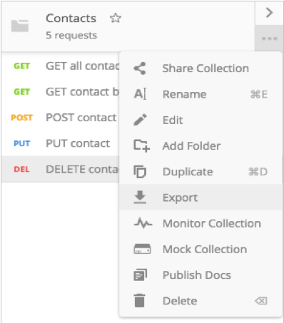

# Prueba de servicios REST

<!--
&nbsp;&nbsp;
-->

Ya hemos visto que probar unos servicios de listado (GET) es sencillo a través de un navegador. Pero los servicios de inserción (POST), modificación (PUT) o borrado (DELETE) exigen de otras herramientas para poder ser probados. Podríamos definir formularios con estos métodos encapsulados, pero el esfuerzo de definir esos formularios para luego no utilizarlos más no merece mucho la pena. Veremos a continuación una herramienta muy útil para probar todo tipo de servicios sin necesidad de implementar nada adicional.

## 1. Introducción a Postman

**Postman** es una aplicación gratuita y multiplataforma que permite enviar todo tipo de peticiones a un servidor determinado, y examinar la respuesta que éste produce. De esta forma, podemos comprobar que los servicios ofrecen la información adecuada antes de ser usados por una aplicación cliente real.

Para descargar e instalar Postman, debemos ir a su web oficial, a la [sección de descargas](https://www.postman.com/downloads/), y descargar la aplicación (en el caso de nuestra máquina virtual, descargaremos la versión para Linux de 64 bits). Es un archivo portable, que se descomprime y dentro está la aplicación lista para ejecutarse.

La primera vez que la ejecutemos nos preguntará si queremos registrarnos, de forma que podamos compartir los proyectos que hagamos entre los distintos equipos en que estemos registrados, pero podemos saltar este paso haciendo clic en el enlace inferior.

## 2. Uso básico de Postman

Tras iniciar la aplicación, veremos la pantalla de inicio de Postman. En un principio aparecerán varias opciones en la zona central, para crear colecciones o peticiones, aunque también las podemos crear desde el botón *New* en la esquina superior izquierda. Por ejemplo, podemos crear una colección "Biblioteca", y aparecerá en el panel izquierdo:

    

Desde el mismo botón *New* en la esquina superior izquierda podemos crear nuevas peticiones y asociarlas a una colección. Existe una forma alternativa (quizá más cómoda) de crear esas peticiones, a través del panel de pestañas, añadiendo nuevas:

    

### 2.1. Añadir peticiones GET

Para añadir una petición, habitualmente elegiremos el tipo de comando bajo las pestañas (GET, POST, PUT, DELETE) y la URL asociada a dicho comando. Por ejemplo:

    

Entonces, podemos hacer clic en el botón "Save" en la parte derecha, y guardar la petición para poderla reutilizar. Al guardarla, nos pedirá que le asignemos un nombre (por ejemplo, "GET libros" en este caso), y la colección en la que se almacenará (nuestra colección de "Biblioteca"). 

    

Después, podremos ver la prueba asociada a la colección, en el panel izquierdo:

    

Si seleccionamos esta prueba y pulsamos en el botón azul de "Send" (parte derecha), podemos ver la respuesta emitida por el servidor en el panel inferior de respuesta (si tenemos, claro está, el servidor en marcha):

    

Siguiendo estos mismos pasos, podemos también crear una nueva petición para obtener un libro a partir de su *id*, por GET:

    

Bastaría con reemplazar el *id* de la URL por el que queramos consultar realmente. Si probamos esta petición, obtendremos la respuesta correspondiente:

    

### 2.2. Añadir otros tipos de peticiones (POST, PUT, DELETE)

Las peticiones **POST** difieren de las peticiones GET en que se envía cierta información en el cuerpo de la petición. Esta información normalmente son los datos que se quieren añadir en el servidor. ¿Cómo podemos hacer esto con Postman?

En primer lugar, creamos una nueva petición, elegimos el comando POST y definimos la URL (en nuestro caso, *localhost:8000/api/libros* o algo similar, dependiendo de cómo tengamos en marcha el servidor). Entonces, hacemos clic en la pestaña *Body*, bajo la URL, y establecemos el tipo como *raw* para que nos deje escribirlo sin restricciones. También conviene cambiar la propiedad *Text* para que sea *JSON*, y que así el servidor recoja el tipo de dato adecuado. Se añadirá automáticamente una cabecera de petición (Header) que especificará que el tipo de contenido que se va a enviar son datos JSON. 
Después, en el cuadro de texto bajo estas opciones, especificamos el objeto JSON que queremos enviar para insertar:

    

Tras esto, basta con guardar la petición como hemos hecho con las anteriores, y lanzarla para ver el resultado.

En cuanto a las peticiones **PUT**, procederemos de forma similar a las peticiones POST: debemos elegir el comando (PUT en este caso), la URL, y completar el cuerpo de la petición con los datos que queramos modificar del contacto. En este caso, además, el *id* del libro lo enviaremos también en la propia URL:

    

Para peticiones **DELETE**, la mecánica es similar a la ficha del elemento (operación GET), cambiando el comando GET por DELETE, y sin necesidad de establecer nada en el cuerpo de la petición:

    

### 2.3. Exportar/Importar colecciones

Podemos exportar e importar nuestras colecciones en Postman, de forma que podemos llevarlas de un equipo a otro. Para **exportar** una colección, hacemos clic en el botón de puntos suspensivos (...) que hay junto a ella en el panel izquierdo, y elegimos *Export*.

    

Nos preguntará para qué versión de Postman queremos exportar (normalmente la recomendada es la mejor opción). Se creará un nuevo archivo Postman en la ubicación que elijamos.

Si queremos **importar** una colección previamente exportada, podemos hacer clic en el botón *Import* de la esquina superior izquierda en la ventana principal y elegir después el archivo a importar.

## 3. Prueba de autenticación por token en Postman

Veamos cómo probar la autenticación por token utilizando Postman. Es necesario que antes de esto hayas echado un vistazo a [cómo definir la autenticación basada en tokens](07b) en aplicaciones Laravel.

En primer lugar, y tras poner en marcha el proyecto, vamos a asegurarnos de que podemos acceder sin restricciones a los servicios que no requieren autorización (típicamente `index` o `show`). Por ejemplo podemos hacer una petición como esta, y ver que obtenemos el resultado devuelto por el método `index`:

    

Ahora vamos a intentar acceder a un recurso protegido, como por ejemplo el borrado, y veremos que obtenemos un código 401 indicando que no nos hemos autenticado:

    

Para autenticarnos con nuestras credenciales y obtener el token, enviamos una petición POST al servicio `api/login` (que deberemos tener implementado), enviando por JSON nuestro login y password. Obtendremos de vuelta el token en formato JSON:

    

Ahora debemos copiar este token, y pegarlo en la petición de acceso restringido. Deberemos pegarlo en la cabecera *Authorization* (abrir esa pestaña bajo la URL de la petición en Postman), y lo normal es enviarlo como un *Bearer token*, según los estándares. Entonces sí tendremos la respuesta correcta de la operación solicitada.

    

A la hora de trasladar estas pruebas a una aplicación "real", enviaríamos las credenciales por JSON al servidor, obtendríamos el token de vuelta y lo almacenaríamos localmente en alguna variable o soporte (por ejemplo, en el elemento `localStorage`, si trabajamos con algún framework JavaScript). Después, ante cada petición JSON que hiciéramos al servidor, adjuntaríamos este token en la cabecera *Authorization* para que fuese validado por el servidor.
