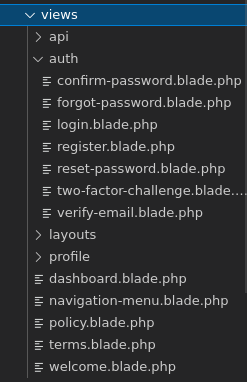
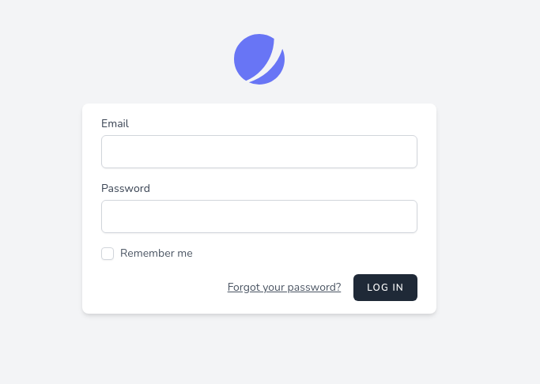

# Autenticación basada en sesiones

<div style="text-align: right">
<!--
<a target="_blank" href="slides/07a.html"></a>&nbsp;&nbsp;
-->
<a target="_blank" href="07a.pdf"></a>
</div>

<div></div>

A la hora de añadir autenticación de usuarios en nuestras aplicaciones Laravel, debemos tener en cuenta que existen dos posibles escenarios:

* Estamos trabajando sobre un proyecto ya existente que no dispone de autenticación
* Estamos creando un nuevo proyecto en el que vamos a definir la autenticación desde el inicio

En el primer caso, deberemos implementar una autenticación más o menos "manual", aunque muy sencilla. En el segundo caso, podemos especificar unas opciones al crear el proyecto que nos facilitarán mucho la incorporación del *login*, e incluso del registro de nuevos usuarios. Veremos cada caso por separado en esta sesión.

## 1. Configuración general de la autenticación

En el archivo `config/auth.php` se dispone de algunas opciones de configuración generales de autenticación. Esta autenticación en Laravel se apoya en dos elementos: los *guards* y los *providers*.

* Los ***guards*** son mecanismos que definen cómo se van a autenticar los usuarios para cada petición. El mecanismo más habitual es mediante sesiones, donde se guarda la información del usuario autenticado en la sesión, aunque por defecto también se habilita la autenticación mediante tokens.
* Los ***providers*** indican cómo se van a obtener los usuarios de la base de datos para comprobar la autenticación. Las opciones habilitadas por defecto son mediante Eloquent (y el modelo de usuarios que tengamos definido), o mediante *query builder*, consultando directamente la tabla correspondiente de usuarios.

Deberemos modificar en el archivo la referencia a la tabla donde almacenaremos los usuarios (por defecto se hace referencia a una tabla llamada `users`) y/o al modelo asociado (por defecto, la clase `User`). Así que convendrá modificar los nombres de estos dos elementos en la sección `providers`, así como la ubicación (*namespace*) del modelo de usuario, si procede. Por ejemplo:

```php

...

'providers' => [
    'users' => [
        'driver' => 'eloquent',
        'model' => App\Models\Usuario::class,
    ],

    // 'users' => [
    //     'driver' => 'database',
    //     'table' => 'usuarios',
    // ],
],
```

Notar que la sección `providers` dispone de dos proveedores de autenticación: uno (el que está habilitado) está basado en Eloquent, y hace uso del modelo de usuarios que hayamos definido. El otro (que aparece comentado) no utiliza Eloquent, sino del *query builder* contra la propia base de datos. Si preferimos esta segunda opción, deberemos comentar la primera y dejar habilitada la segunda. También es posible dejar habilitados múltiples *providers*, cada uno con un nombre diferente, y asignarlo a múltiples *guards*. 

### 1.1. El modelo o la tabla de usuarios

Si elegimos el *provider* basado en Eloquent, deberemos tener un modelo de usuarios al que acceder. En el caso de nuestra aplicación de biblioteca (o el ejercicio del blog), disponemos ya de un modelo creado en `App\Models\Usuario`, por lo que el ejemplo anterior nos serviría para establecer este modelo como el modelo de usuarios por defecto.

Si optamos por utilizar el *query builder* en lugar de Eloquent, deberemos tener una tabla en la base de datos donde estén los datos de los usuarios. En nuestro caso, también disponemos de esa tabla *usuarios*, por lo que podríamos emplear esta otra opción para autenticar usuarios si quisiéramos. No obstante, nos valdremos de Eloquent para la autenticación.

En cualquier caso, como veremos a continuación, será conveniente que los passwords de los usuarios estén **encriptados** mediante *bcrypt*, que es el mecanismo de encriptación por defecto que utiliza Laravel. Vamos a crear un nuevo *seeder* en nuestra aplicación de *biblioteca* para crear un usuario con un login y password predefinidos. Llamamos al *seeder* `UsuariosSeeder`:

```
php artisan make:seeder UsuariosSeeder
```

En el método `run` del nuevo *seeder* añadiremos un nuevo usuario con login *admin* y password *admin* (encriptado usando *bcrypt*):

```php
public function run()
{
    $usuario = new Usuario();
    $usuario->login = 'admin';
    $usuario->password = bcrypt('admin');
    $usuario->save();
}
```

Finalmente, cargamos este nuevo *seeder* en la base de datos, o bien con una migración completa nueva (`php artisan migrate:fresh --seed`), o bien ejecutando sólo el seeder con esto:

```
php artisan db:seed --class=UsuariosSeeder
```

## 2. Añadir autenticación a un proyecto existente

Para añadir autenticación a un proyecto Laravel ya existente que no disponga de estos mecanismos, seguiremos estos pasos:

1. Definiremos un formulario de login
2. Definiremos un nuevo controlador que se encargue de gestionar el login: tanto de mostrar el formulario cuando el usuario no esté autenticado como de validar sus credenciales cuando las envíe
3. Añadiremos las rutas pertinentes en el archivo `routes/web.php` tanto para el formulario de login como para la autenticación posterior
4. Protegeremos las rutas que sean de acceso restringido
5. Opcionalmente, podemos añadir también una opción de *logout*.

### 2.1. El formulario de login

Vamos a definir un formulario de login en la vista `resources/views/auth/login.blade.php`, para que el usuario especifique su *login* y su *password*. También dejaremos una zona para mostrar un posible mensaje de error si la autenticación no ha sido exitosa:

<!---->
```php
@extends('plantilla')

@section('titulo', 'Login')

@section('contenido')

    <h1>Login</h1>

    @if (!empty($error))
    <div class="text-danger">
        {{ $error }}
    </div>
    @endif

    <form action="{{ route('login') }}" method="POST">

        @csrf

        <div class="form-group">
            <label for="login">Login:</label>
            <input type="text" class="form-control" 
             name="login" id="login" />
        </div>

        <div class="form-group">
            <label for="password">Password:</label>
            <input type="password" class="form-control" 
             name="password" id="password" />
        </div>

        <input type="submit" name="enviar" value="Enviar" 
         class="btn btn-dark btn-block">

    </form>

@endsection
```
<!---->

### 2.2. El controlador de login

Crearemos un nuevo controlador que se encargue de gestionar toda la autenticación:

```
php artisan make:controller LoginController
```

Dentro, definimos una función que se encargará de mostrar el formulario anterior:

```php
public function loginForm()
{
    return view('auth.login');
}
```

Y añadiremos una segunda función que se encargue de validar las credenciales enviadas por el usuario. Para esto, haremos uso del *facade* de autenticación, existente en `Illuminate\Support\Facades\Auth`. Recuerda de sesiones previas que un *facade* es básicamente un elemento que proporciona acceso a una serie de métodos estáticos de utilidad, en este caso para autenticar usuarios.

```php
namespace App\Http\Controllers;

use Illuminate\Http\Request;
use Illuminate\Support\Facades\Auth;

class LoginController extends Controller
{
    ...

    public function login(Request $request)
    {
        $credenciales = $request->only('login', 'password');

        if (Auth::attempt($credenciales)) 
        {
            // Autenticación exitosa
            return redirect()->intended(route('libros.index'));
        } else {
            $error = 'Usuario incorrecto';
            return view('auth.login', compact('error'));
        }
    }
}
```

El método `attempt` acepta una serie de pares *clave-valor* como primer parámetro. En este caso, le pasamos un sólo par formado por el login (o el e-mail, dependiendo del campo que usemos para autenticar) y el password recibidos en la petición. Esto servirá para localizar al usuario por la clave (login), y comprobar si tiene el valor asociado (el password). En el caso de los passwords, Laravel automáticamente los encripta en formato *bcrypt*, por lo que debemos cerciorarnos de que el password está encriptado en ese formato en la base de datos.

Por otra parte, el método `intended` trata de enviar al usuario a la ruta a la que intentaba acceder antes de que se le solicitara autenticación. Le pasamos como parámetro una ruta por defecto en el caso de que el destino previsto no esté disponible.

### 2.3. Las rutas asociadas

Finalmente, debemos definir las rutas tanto para mostrar el formulario (por *get*) como para recoger las credenciales y validar al usuario (por *post*). 

```php
Route::get('login', [LoginController::class, 'loginForm'])->name('login');
Route::post('login', [LoginController::class, 'login']);
```

#### 2.3.1. Redirección en caso de error

Cuando se detecta que un usuario no autenticado intenta acceder a una ruta protegida, automáticamente se le redirige a la ruta nombrada como *login* (como la que hemos definido previamente), donde verá el formulario de acceso. Si queremos cambiar el nombre de la ruta a la que redirigir (en el caso de que no queramos que sea *login*), debemos modificar el método `redirectTo` en el *middleware* de autenticación `app/Http/Middleware/Authenticate.php`:

```php
protected function redirectTo($request)
{
    ...
    return route('login');
}
```

### 2.4. Proteger las rutas de acceso restringido

Ahora que ya tenemos definido el mecanismo de login (controlador con método de autenticación, formulario de login y ruta asociada), podemos proteger aquellas rutas o enlaces que queramos que sean de acceso restringido. Por ejemplo, podemos hacer que las operaciones de creación, borrado y edición de libros (funciones `create`, `store`, `edit`, `update` y `destroy`) sólo estén disponibles para usuarios autenticados. Esto puede hacerse de varias formas.

* Si tenemos una ruta de recursos (`Route::resource`) en el archivo `routes/web.php`, entonces la opción más cómoda es definir un constructor en el controlador asociado (en este caso, `LibroController`), y especificar qué funciones queremos proteger, bien con `only` o con `except` (en este último caso, se protegerán todas las rutas salvo las indicadas en la lista):

```php
class LibroController extends Controller
{
    public function __construct()
    {
        $this->middleware('auth', 
            ['only' => ['create', 'store', 'edit', 'update', 'destroy']]);
    }

    ...
```

* Si definimos las rutas sueltas, podemos emplear el método `middleware` para indicar en cada una si queremos que se aplique el *middleware* de autenticación:

```php
Route::get('prueba', [PruebaController::class, 'create'])->middleware('auth');
```

### 2.5. Detectar en las vistas al usuario autenticado

Puede ser muy necesario detectar en una vista si el usuario se ha autenticado o no, bien para mostrar ciertos controles (por ejemplo, enlaces para crear libros), o para cargar información propia del usuario (por ejemplo, posts creados por el usuario que ha entrado en un blog).

Por ejemplo, de este modo podemos modificar el menú de navegación (`resources/views/partials/nav.blade.php`) para que muestre el enlace de crear nuevo libro sólo si el usuario se ha autenticado:

<!---->
```php
@if(auth()->check())
    <li class="{{ setActivo('libros.create') }} nav-item">
        <a class="nav-link" href="{{ route('libros.create') }}">Nuevo libro</a>
    </li>
@endif
```
<!---->

Podemos emplear el método `auth()->guest()` si queremos comprobar si el usuario aún NO se ha autenticado (por ejemplo, para mostrarle el enlace a *login*), y el método `auth()->check()` para comprobar si SI está autenticado (para mostrarle, por ejemplo, las opciones restringidas). De forma análoga, el método `auth()->user()` obtiene el objeto del usuario autenticado, con lo que podemos acceder a sus atributos:

<!---->
```php
Bienvenido/a {{ auth()->user()->login }}
```
<!---->


### 2.6. Implementación del *logout*

Para implementar el *logout*, basta con llamar al método `logout` del *facade* `Auth` utilizado anteriormente, en el método que se vaya a encargar de esa tarea. Lo podemos añadir en el mismo controlador anterior:

```php
namespace App\Http\Controllers;

use Illuminate\Http\Request;
use Illuminate\Support\Facades\Auth;

class LoginController extends Controller
{
    ...

    public function logout()
    {
        Auth::logout();
        // ... Renderizar la vista deseada
    }
```

También hará falta definir la ruta asociada en `routes/web.php`:

```php
Route::get('logout', [LoginController::class, 'logout'])->name('logout');
```

Obviamente, también será necesario añadir un enlace para hacer *logout* en alguna parte. Podemos ponerlo en el menú de navegación (archivo `resources/views/partials/nav.blade.php`, cuando detectemos que el usuario está autenticado):

<!---->
```php
@if(auth()->check())
    <li class="{{ setActivo('libros.create') }} nav-item">
        <a class="nav-link" href="{{ route('libros.create') }}">Nuevo libro</a>
    </li>
    <li class="nav-item">
        <a class="nav-link" href="{{ route('logout') }}">Logout</a>
    </li>
@endif
```
<!---->

## 3. Crear un proyecto desde cero con autenticación incorporada

Laravel también ofrece la opción de crear un proyecto desde cero incorporando mecanismos de autenticación de usuarios desde el principio. Esta opción ha variado con el paso de las versiones de Laravel, pero básicamente se conserva una misma esencia: cuando creamos el proyecto, podemos dejar ya establecido el modelo de usuarios, y mecanismos para registrar y autenticar usuarios en la aplicación.

### 3.1. Creación de proyectos con Laravel 8

Para crear un proyecto con esta infraestructura ya definida ejecutamos el comando `laravel new` con la opción `--jet` en Laravel 8. 

```
laravel new nombre_proyecto --jet
```

Tras ejecutar el comando, nos pedirá que elijamos entre *Livewire* o *Inertia* como nuestro *JetStream stack*, o en otras palabras, la tecnología que se va a encargar de generar la parte de *frontend*. **Livewire** está basado en el propio motor de plantillas de Blade, y generará en la carpeta *resources/views* una serie de plantillas para formularios de registro, login, etc. 

<div align="center">
    
</div>

Una vez creado el proyecto con Livewire, deberemos ejecutar este comando desde su carpeta principal para instalar los componentes restantes de la parte de JavaScript:

``` 
npm install
npm ci
npm run dev
```

Por otra parte, **Inertia** está basado en el framework de cliente Vue. La gestión de plantillas la controla el propio Vue y las plantillas o componentes no se ubican en *resources/views* sino en *resources/js/jetstream*, donde podremos encontrar una serie de componentes de Vue para la autenticación y gestión de usuarios. La carpeta *resources/views* tendrá el aspecto habitual de otros proyectos (una plantilla de bienvenida, que en este caso se llama *app.blade.php*). 

### 3.2. Creación de proyectos con versiones anteriores de Laravel

En el caso de tener alguna versión anterior del instalador *laravel*, podemos obtener un resultado similar con el comando:

```
laravel new nombre_proyecto --auth
```

Se obtiene un resultado similar al explicado para Livewire con Laravel 8, aunque en este caso empleando el *scaffolding* estándar de autenticación de esta versión. Una de las principales diferencias entre ambas versiones es que en Laravel 7 se emplea Bootstrap para la apariencia o el diseño web, y en Laravel 8 se emplea Tailwind.

### 3.3. Puesta en marcha y prueba de la aplicación

Si probamos a lanzar la aplicación y accedemos a su página de inicio (*http://localhost:8000* si la hemos lanzado con *php artisan serve*), veremos en la esquina superior derecha enlaces para registrarnos y acceder al formulario de login. El formulario de *login* tendrá una apariencia como ésta en Laravel 8:

<div align="center">
    
</div>

Evidentemente, antes de poder hacer nada necesitamos tener una base de datos creada. Recuerda crearla y modificar los datos de conexión en el archivo `.env` de tu proyecto, y también ejecutar las migraciones predefinidas en el proyecto con `php artisan migrate:fresh`.

### 3.4. Cambiar el idioma

Uno de los inconvenientes que tenemos al utilizar este *scaffolding* es que todos los enlaces y campos de formularios que se han creado vienen con textos en inglés. Podemos añadir mensajes en otros idiomas con dos pasos sencillos:

* Por un lado, debemos modificar la región (*locale*) por defecto definida en el archivo `config/app.php`. Así la dejaríamos para fijar el idioma en español:

```php
'locale' => 'es',
```

* Por otro lado, debemos descargar el paquete de ficheros en el idioma correspondiente, y ubicarlo en la subcarpeta adecuada dentro de `resources/lang`. En nuestro caso, podemos por ejemplo copiar los archivos de [esta carpeta](https://github.com/Laraveles/spanish/tree/master/resources/lang) en la subcarpeta `resources/lang` de nuestro proyecto, de forma que el archivo `es.json` quedará en esa carpeta, y además se creará una subcarpeta `es` con el contenido de los archivos que hay en ese repositorio. Si les echamos un vistazo, podemos ver que contienen las traducciones al español de distintos mensajes de distintas secciones de la web.

Con esto ya podremos ver los contenidos de la web en español. Esta "magia" se debe a que en las vistas que hemos cargado, los mensajes se obtienen directamente de esta carpeta `resources/lang` para el idioma especificado en `config/app.php`. Por ejemplo, así se muestra el mensaje *Forgot Your Password?* original en el formulario de login:

<!---->
```php
<a class="btn btn-link" href="{{ route('password.request') }}">
    {{ __('Forgot Your Password?') }}
</a>
```
<!---->

La instrucción `__()` busca la clave que le pasemos (*Forgot Your Password?*) en los archivos de configuración en inglés, y si no la encuentra, pone directamente la clave sin más. Si buscamos esta misma clave en el archivo `es.json` que hemos descargado, podemos ver por qué texto se sustituirá cuando cambiemos el idioma a español:

```json
"Forgot Your Password?": "¿Olvidaste tu contraseña?",
```

### 3.5. Proteger rutas

A partir del *scaffolding* proporcionado, el mecanismo para proteger rutas es similar al visto anteriormente. Una vez hayamos creado nuestros modelos, controladores, etc, añadimos el *middleware* `auth` o bien en el constructor del controlador (si hemos definido una ruta de recursos `Route::resource`), o bien podemos hacerlo ruta a ruta en el archivo de rutas (si hemos definido individualmente cada ruta). También podemos hacer uso de `auth()->guest()`, `auth()->check()`, etc, en las vistas, para comprobar si el usuario se ha autenticado, o los datos del usuario autenticado.

### 3.6. Otras consideraciones

La incorporación del *scaffolding* de autenticación, como podemos comprobar, ahorra mucho trabajo a la hora de definir los mecanismos de registro y login de usuarios en el sistema. Sin embargo, quedan algunas tareas pendientes que pueden requerir una configuración adicional, y que no veremos en este curso por falta de tiempo.

Una de ellas, por ejemplo, es la opción de recuperar contraseña cuando pinchamos en el enlace de *¿Olvidaste tu contraseña?*. En principio, y dado que nos registramos con un e-mail como *login*, nos pide que facilitemos dicho e-mail para enviarnos un enlace para restablecer la contraseña. Sin embargo, debemos configurar apropiadamente el correo SMTP para poder enviar el mensaje. Para ello, necesitamos una cuenta origen, y dependiendo del servidor de correo donde la tengamos creada (Gmail, Outlook, etc), la configuración es diferente. [Aquí](https://medium.com/@agavitalis/how-to-send-an-email-in-laravel-using-gmail-smtp-server-53d962f01a0c), por ejemplo, explica los pasos a seguir para configurar como cuenta emisora una de Gmail. Pero, como decimos, estos contenidos quedan fuera del alcance del curso.

## 4. Definir roles. Uso de *middleware*

Para poder definir roles para los distintos usuarios de nuestra aplicación, obviamente debemos comenzar por definir un nuevo campo en la tabla de usuarios para almacenar dicho rol.

Después, para proteger ciertas rutas en función de los roles, podemos ocultar el enlace en las vistas con una simple comprobación. Por ejemplo, asumiendo que el campo de los roles se llama `rol`:

```php
@if (auth()->user()->rol === 'admin')
    // Mostrar contenido
@endif
```

Sin embargo, si accedemos a la URL sin pasar por el enlace, podremos ver el contenido. Debemos nuevamente incorporar el *middleware* `auth` al controlador que corresponda (si no lo está ya), para proteger el acceso general para usuarios autenticados. 

Además, debemos definir un *middleware* propio que verifique el rol del usuario logueado. Podemos crearlo con este comando:

```
php artisan make:middleware RolCheck
```

En este caso hemos llamado al *middleware* `RolCheck`, pero el nombre puede ser el que queramos. Este *middleware* se creará en la carpeta `App\Http\Middleware`. Debemos editar su método `handle` para verificar que los usuarios son de tipo "admin":

```php
public function handle($request, Closure $next, $rol)
{
    if (auth()->user()->rol === $rol)
        return $next($request);
    else
        return redirect('/');
}
```

Tras definir el *middleware*, lo registramos en el archivo `App/Http/Kernel.php` (en el apartado de *routeMiddleware*):


```php
protected $routeMiddleware = [
    ...
    'roles' => \App\Http\Middleware\RolCheck::class
```

Finalmente, lo cargamos en el constructor de nuestro controlador. Podemos incluir con `except` y `only` restricciones sobre qué métodos del controlador se verán afectados o no por el *middleware*.

```php
public function __construct()
{
    $this->middleware(['auth', 'roles:admin']);
}
```

En este ejemplo, hemos mapeado el *middleware* con el alias *roles* en el archivo `Kernel.php`, y lo que hay tras los dos puntos es el parámetro extra que tiene el método `handle` del *middleware* (el rol a comprobar). En el caso de querer pasar más parámetros, se puede hacer separados por comas.

### 4.1. Sobre el concepto de *middleware*

Hemos comentado brevemente el concepto de *middleware* asociado tanto al mecanismo de autenticación como a la clase "extra" que podemos crear para comprobar roles. En general, un **middleware** es un fragmento de código (normalmente una función) que se ejecuta en medio de un proceso. En este caso, se ejecuta desde que se recibe la petición hasta que se emite la respuesta, y permite alterar ese flujo normal, haciendo ciertas comprobaciones sobre la petición. Por ejemplo, como es el caso, verificar que el usuario tiene los permisos adecuados antes de emitir una respuesta u otra.

# 5. Más información

Los mecanismos de autenticación de Laravel son muy variados y flexibles. Aquí hemos pretendido ofrecer sólo una parte, quizá la más habitual o estándar. Para más información, podéis consultar la documentación oficial:

* [Autenticación con Laravel](https://laravel.com/docs/authentication)
* [Uso de middleware](https://laravel.com/docs/middleware)
